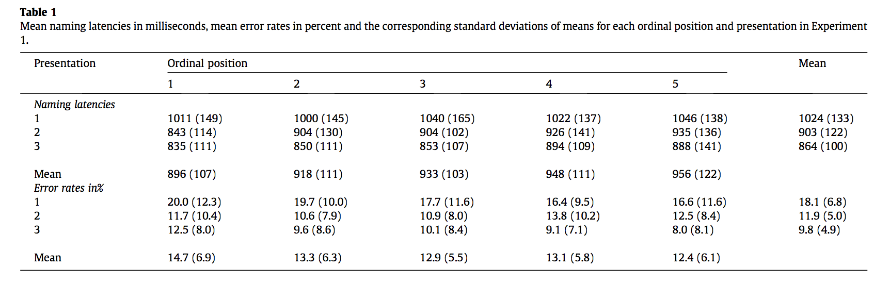
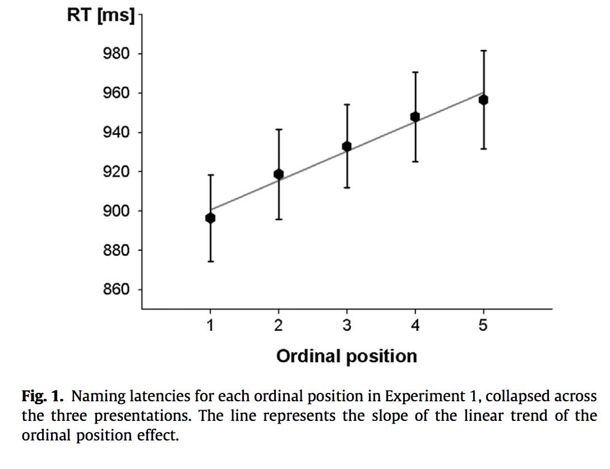
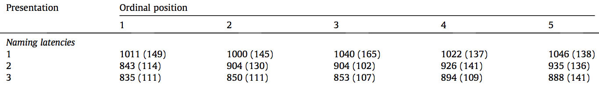
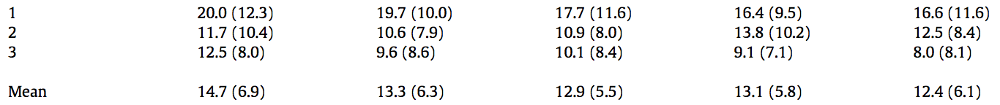

#### Article ID: IBRbN
#### Pilot: Kyle MacDonald
#### Copilot: Mike Frank
#### Start date: Apr 21 2017
#### End date: Jul 14 2017 
#### Final verification: Tom Hardwicke
#### Date: Nov 9 2017

-------

#### Methods summary: 

On each trial, adult participants saw pictures of concrete objects (e.g., a soccer ball) on a computer screen and were asked to produce the verbal label for that object as quickly as possible. The target words were generated from a set of 16 themes (e.g., soccer) and the key predictor variable was the *ordinal position* of the target word within its thematic context -- that is, how many words from that theme had the participant already named in the experiment. The dependent variables were participants' reaction times (RTs) and error rates, and the prediction was that words with higher ordinal positions would have slower RTs because of the "cumulative" interference from the previously named words within that theme.

------

#### Target outcomes: 

For this article you should focus on the findings reported for Experiment 1 in section 2.2. Results and discussion. Specifically, you should attempt to reproduce all descriptive and inferential analyses reported in the text below and associated tables/figures:

> Reaction times (RTs) for correct responses for each ordinal position of an item within the presented theme, collapsed across the three presentations, are presented in Fig. 1 (see also Table 1). A repeated measures analysis of variance (ANOVA) with the factors ordinal position (5) and presentation (3) with participants (F1) and themes (F2) as random variables (cf. Belke and Stielow, 2013 and Howard et al., 2006) revealed a main effects of presentation (F1(2, 46) = 54, p < .001, View the MathML source = .70; F2(2, 30) = 130.6, p < .001, View the MathML source = .89) and ordinal position (F1(4, 92) = 11.1, p < .001, View the MathML source = .33; F2(4, 60) = 7.0, p < .001, View the MathML source = .32). There was no interaction between presentation and ordinal position, Fs < 1.7. For the ordinal position effect, there was a significant linear trend, F1(1, 23) = 36.6, p < .001, View the MathML source = .62; F2(1, 15) = 19.1, p < .001, View the MathML source = .56, indicating that RTs increased linearly with each ordinal position.

> An ANOVA of mean error rates revealed a main effect of presentation (F1 (2, 46) = 26, p < .001, View the MathML source = .53; F2(1, 30) = 30.2, p < .001, View the MathML source = .66) that reflects a decrease in errors between the first and later presentations (cf. Table 1). No other effects were found, Fs < 0.8.

Here's the relevant table and figure from the paper:  





------

```{r global_options, include=FALSE}
knitr::opts_chunk$set(echo=TRUE, warning=FALSE, message=FALSE)

# prepare an empty report object, we will update this each time we run compareValues2()
reportObject <- data.frame("Article_ID" = NA, "valuesChecked" = 0, "eyeballs" = 0, "Total_df" = 0, "Total_p" = 0, "Total_mean" = 0, "Total_sd" = 0, "Total_se" = 0, "Total_ci" = 0, "Total_bf" = 0, "Total_t" = 0, "Total_F" = 0, "Total_es" = 0, "Total_median" = 0, "Total_irr" = 0, "Total_r" = 0, "Total_z" = 0, "Total_coeff" = 0, "Total_n" = 0, "Total_x2" = 0, "Total_other" = 0, "Insufficient_Information_Errors" = 0, "Decision_Errors" = 0, "Major_Numerical_Errors" = 0, "Minor_Numerical_Errors" = 0, "Major_df" = 0, "Major_p" = 0, "Major_mean" = 0, "Major_sd" = 0, "Major_se" = 0, "Major_ci" = 0, "Major_bf" = 0, "Major_t" = 0, "Major_F" = 0, "Major_es" = 0, "Major_median" = 0, "Major_irr" = 0, "Major_r" = 0, "Major_z" = 0, "Major_coeff" = 0, "Major_n" = 0, "Major_x2" = 0, "Major_other" = 0, "affectsConclusion" = NA, "error_typo" = 0, "error_specification" = 0, "error_analysis" = 0, "error_data" = 0, "error_unidentified" = 0, "Author_Assistance" = NA, "resolved_typo" = 0, "resolved_specification" = 0, "resolved_analysis" = 0, "resolved_data" = 0, "correctionSuggested" = NA, "correctionPublished" = NA)
```

## Step 1: Load packages

```{r}
library(tidyverse) # for data munging
library(knitr) # for kable table formating
library(haven) # import and export 'SPSS', 'Stata' and 'SAS' Files
library(readxl) # import excel files
library(CODreports) # custom report functions
library(magrittr) # for compound pipes
library(stringr) # for working with strings
library(ez) # for anovas
library(afex) # for anovas
library(lme4) # LMEMs
library(lmerTest) # ANOVA for LMEM
```

## Step 2: Load data

Read the first sheet of excel workbook to get Experiment 1 data.

```{r}
d <- read_excel(path = "data/data.xlsx", sheet = 1)
```

Check the structure of the data.

```{r}
glimpse(d)
```

Data are already in long format and look relatively tidy. 

Check if we have 24 participants.

```{r}
n_expected <- 24

test_n <- d %>% 
  select(`Participant(F1)`) %>% 
  unique() %>% 
  nrow() == n_expected
```

The output of the test is: `r test_n`, so we have the correct number of participants.

Check if we have 5 ordinal positions:

```{r}
pos_expected <- 5

test_ord <- d %>% 
  select(OrdPosition) %>% 
  unique() %>% 
  nrow() == pos_expected
```

The output of the test is: `r test_ord`, so there are a different number of ordinal positions in the data file (reported = 5, obtained = 6).

```{r}
qplot(x = `Theme(F2)`, OrdPosition, geom = "jitter", data = d) + 
  theme(axis.text.x = element_text(angle = 90, hjust = .5))
```

Fillers are in position 6. Filter them. 

```{r}
d %<>% filter(!str_detect(`Theme(F2)`, "Filler"))
```

Check if we have 3 presentations:

```{r}
presents_expected <- 3

test_present <- d %>% select(Presentation) %>% 
  unique() %>% 
  nrow() == presents_expected
```

The output of the test is: `r test_present`, so we have the correct number of presentation orders.

## Step 3: Tidy data

Create binary (T/F) accuracy variable by recoding the `ErrorCode` var (175 = correct; not sure what 176 or 177 mean).

```{r}
correct_code <- 175

d %<>% mutate(correct = ifelse(`ErrorCode (175=correct)` == correct_code, 
                               TRUE, 
                               FALSE))
```

## Step 4: Run analysis

### Pre-processing

No pre-processing steps reported in the paper.

### Descriptive statistics

Try to reproduce the values in Table 1. From the table caption, 

> Mean naming latencies in milliseconds, mean error rates in percent and the corresponding standard deviations of means for each ordinal position and presentation.

Rose and Rahman do not report whether they averaged for participants prior to getting condition averages, so I wasn't exactly sure how to do the aggregation to reproduce their table. 

We assume first that this is done by first aggregating subject means and then further aggregating acrodss means. (This decision is important because data are slightly unbalanced across participants). 

```{r}
# average rt for each participant and condition
ss_rt <- d %>% 
  filter(correct == T) %>% # just keep correct RTs
  group_by(`Participant(F1)`, OrdPosition, Presentation) %>% 
  summarise(ss_rt = mean(RT)) 
  
# for each condition
ms_rt <- ss_rt %>% 
  group_by(OrdPosition, Presentation) %>% 
  summarise(m = mean(ss_rt),
            sd = sd(ss_rt)) %>% 
  mutate_if(is.numeric, round, digits = 0)

tab1 <- ms_rt %>% 
  ungroup %>%
  gather(measure, rt, m, sd) %>%
  mutate(ord_measure = paste0(as.character(OrdPosition), "-", measure)) %>%
  select(-OrdPosition, -measure) %>%
  spread(ord_measure, rt)

kable(tab1)
```


Explictly compare all means:

```{r}
pres1_ord1_m <- tab1 %>% filter(Presentation == 1) %>% pull("1-m")
pres1_ord2_m <- tab1 %>% filter(Presentation == 1) %>% pull("2-m")
pres1_ord3_m <- tab1 %>% filter(Presentation == 1) %>% pull("3-m")
pres1_ord4_m <- tab1 %>% filter(Presentation == 1) %>% pull("4-m")
pres1_ord5_m <- tab1 %>% filter(Presentation == 1) %>% pull("5-m")

pres2_ord1_m <- tab1 %>% filter(Presentation == 2) %>% pull("1-m")
pres2_ord2_m <- tab1 %>% filter(Presentation == 2) %>% pull("2-m")
pres2_ord3_m <- tab1 %>% filter(Presentation == 2) %>% pull("3-m")
pres2_ord4_m <- tab1 %>% filter(Presentation == 2) %>% pull("4-m")
pres2_ord5_m <- tab1 %>% filter(Presentation == 2) %>% pull("5-m")

pres3_ord1_m <- tab1 %>% filter(Presentation == 3) %>% pull("1-m")
pres3_ord2_m <- tab1 %>% filter(Presentation == 3) %>% pull("2-m")
pres3_ord3_m <- tab1 %>% filter(Presentation == 3) %>% pull("3-m")
pres3_ord4_m <- tab1 %>% filter(Presentation == 3) %>% pull("4-m")
pres3_ord5_m <- tab1 %>% filter(Presentation == 3) %>% pull("5-m")
```

Reprinting:


```{r}
reportObject <- compareValues2(reportedValue = "1011", obtainedValue = pres1_ord1_m, valueType = 'mean')
reportObject <- compareValues2(reportedValue = "843", obtainedValue = pres2_ord1_m, valueType = 'mean')
reportObject <- compareValues2(reportedValue = "835", obtainedValue = pres3_ord1_m, valueType = 'mean')
reportObject <- compareValues2(reportedValue = "1000", obtainedValue = pres1_ord2_m, valueType = 'mean')
reportObject <- compareValues2(reportedValue = "904", obtainedValue = pres2_ord2_m, valueType = 'mean')
reportObject <- compareValues2(reportedValue = "850", obtainedValue = pres3_ord2_m, valueType = 'mean')
reportObject <- compareValues2(reportedValue = "1040", obtainedValue = pres1_ord3_m, valueType = 'mean')
reportObject <- compareValues2(reportedValue = "904", obtainedValue = pres2_ord3_m, valueType = 'mean')
reportObject <- compareValues2(reportedValue = "853", obtainedValue = pres3_ord3_m, valueType = 'mean')
reportObject <- compareValues2(reportedValue = "1022", obtainedValue = pres1_ord4_m, valueType = 'mean')
reportObject <- compareValues2(reportedValue = "926", obtainedValue = pres2_ord4_m, valueType = 'mean')
reportObject <- compareValues2(reportedValue = "894", obtainedValue = pres3_ord4_m, valueType = 'mean')
reportObject <- compareValues2(reportedValue = "1046", obtainedValue = pres1_ord5_m, valueType = 'mean')
reportObject <- compareValues2(reportedValue = "935", obtainedValue = pres2_ord5_m, valueType = 'mean')
reportObject <- compareValues2(reportedValue = "888", obtainedValue = pres3_ord5_m, valueType = 'mean')
```

Explictly compare all SDs:

```{r}
pres1_ord1_sd <- tab1 %>% filter(Presentation == 1) %>% pull("1-sd")
pres1_ord2_sd <- tab1 %>% filter(Presentation == 1) %>% pull("2-sd")
pres1_ord3_sd <- tab1 %>% filter(Presentation == 1) %>% pull("3-sd")
pres1_ord4_sd <- tab1 %>% filter(Presentation == 1) %>% pull("4-sd")
pres1_ord5_sd <- tab1 %>% filter(Presentation == 1) %>% pull("5-sd")

pres2_ord1_sd <- tab1 %>% filter(Presentation == 2) %>% pull("1-sd")
pres2_ord2_sd <- tab1 %>% filter(Presentation == 2) %>% pull("2-sd")
pres2_ord3_sd <- tab1 %>% filter(Presentation == 2) %>% pull("3-sd")
pres2_ord4_sd <- tab1 %>% filter(Presentation == 2) %>% pull("4-sd")
pres2_ord5_sd <- tab1 %>% filter(Presentation == 2) %>% pull("5-sd")

pres3_ord1_sd <- tab1 %>% filter(Presentation == 3) %>% pull("1-sd")
pres3_ord2_sd <- tab1 %>% filter(Presentation == 3) %>% pull("2-sd")
pres3_ord3_sd <- tab1 %>% filter(Presentation == 3) %>% pull("3-sd")
pres3_ord4_sd <- tab1 %>% filter(Presentation == 3) %>% pull("4-sd")
pres3_ord5_sd <- tab1 %>% filter(Presentation == 3) %>% pull("5-sd")
```

Reprinting:


```{r}
reportObject <- compareValues2(reportedValue = "149", obtainedValue = pres1_ord1_sd, valueType = 'sd')
reportObject <- compareValues2(reportedValue = "114", obtainedValue = pres2_ord1_sd, valueType = 'sd')
reportObject <- compareValues2(reportedValue = "111", obtainedValue = pres3_ord1_sd, valueType = 'sd')
reportObject <- compareValues2(reportedValue = "145", obtainedValue = pres1_ord2_sd, valueType = 'sd')
reportObject <- compareValues2(reportedValue = "130", obtainedValue = pres2_ord2_sd, valueType = 'sd')
reportObject <- compareValues2(reportedValue = "111", obtainedValue = pres3_ord2_sd, valueType = 'sd')
reportObject <- compareValues2(reportedValue = "165", obtainedValue = pres1_ord3_sd, valueType = 'sd')
reportObject <- compareValues2(reportedValue = "102", obtainedValue = pres2_ord3_sd, valueType = 'sd')
reportObject <- compareValues2(reportedValue = "107", obtainedValue = pres3_ord3_sd, valueType = 'sd')
reportObject <- compareValues2(reportedValue = "137", obtainedValue = pres1_ord4_sd, valueType = 'sd')
reportObject <- compareValues2(reportedValue = "141", obtainedValue = pres2_ord4_sd, valueType = 'sd')
reportObject <- compareValues2(reportedValue = "109", obtainedValue = pres3_ord4_sd, valueType = 'sd')
reportObject <- compareValues2(reportedValue = "138", obtainedValue = pres1_ord5_sd, valueType = 'sd')
reportObject <- compareValues2(reportedValue = "136", obtainedValue = pres2_ord5_sd, valueType = 'sd')
reportObject <- compareValues2(reportedValue = "141", obtainedValue = pres3_ord5_sd, valueType = 'sd')
```

We see very minor differences throughout (at most 1ms).

Do the same aggregation for accuracy scores (reported in %). Note that we multiply by 100 to convert proportion to percentage and then subtract from 100 to convert to mean error rate.

```{r}
# average acc each participant and condition
ss_acc <- d %>% 
  group_by(`Participant(F1)`, OrdPosition, Presentation) %>% 
  summarise(ss_acc = mean(correct)) 
  
# average for each condition '
ms_acc <- ss_acc %>% 
  group_by(OrdPosition, Presentation) %>% 
  summarise(m = 100 - (mean(ss_acc) * 100),
            sd = (sd(ss_acc) * 100)) %>% 
  mutate_if(is.numeric, round, digits = 1) 

tab1_acc <- ms_acc %>%  
  ungroup %>%
  gather(measure, accuracy, m, sd) %>%
  mutate(ord_measure = paste0(as.character(OrdPosition), "-", measure)) %>%
  select(-OrdPosition, -measure) %>%
  spread(ord_measure, accuracy)
```


Explictly compare all means:

```{r}
pres1_ord1_m <- tab1_acc %>% filter(Presentation == 1) %>% pull("1-m")
pres1_ord2_m <- tab1_acc %>% filter(Presentation == 1) %>% pull("2-m")
pres1_ord3_m <- tab1_acc %>% filter(Presentation == 1) %>% pull("3-m")
pres1_ord4_m <- tab1_acc %>% filter(Presentation == 1) %>% pull("4-m")
pres1_ord5_m <- tab1_acc %>% filter(Presentation == 1) %>% pull("5-m")

pres2_ord1_m <- tab1_acc %>% filter(Presentation == 2) %>% pull("1-m")
pres2_ord2_m <- tab1_acc %>% filter(Presentation == 2) %>% pull("2-m")
pres2_ord3_m <- tab1_acc %>% filter(Presentation == 2) %>% pull("3-m")
pres2_ord4_m <- tab1_acc %>% filter(Presentation == 2) %>% pull("4-m")
pres2_ord5_m <- tab1_acc %>% filter(Presentation == 2) %>% pull("5-m")

pres3_ord1_m <- tab1_acc %>% filter(Presentation == 3) %>% pull("1-m")
pres3_ord2_m <- tab1_acc %>% filter(Presentation == 3) %>% pull("2-m")
pres3_ord3_m <- tab1_acc %>% filter(Presentation == 3) %>% pull("3-m")
pres3_ord4_m <- tab1_acc %>% filter(Presentation == 3) %>% pull("4-m")
pres3_ord5_m <- tab1_acc %>% filter(Presentation == 3) %>% pull("5-m")
```

Reprinting:


```{r}
reportObject <- compareValues2(reportedValue = "20.0", obtainedValue = pres1_ord1_m, valueType = 'mean')
reportObject <- compareValues2(reportedValue = "11.7", obtainedValue = pres2_ord1_m, valueType = 'mean')
reportObject <- compareValues2(reportedValue = "12.5", obtainedValue = pres3_ord1_m, valueType = 'mean')
reportObject <- compareValues2(reportedValue = "19.7", obtainedValue = pres1_ord2_m, valueType = 'mean')
reportObject <- compareValues2(reportedValue = "10.6", obtainedValue = pres2_ord2_m, valueType = 'mean')
reportObject <- compareValues2(reportedValue = "9.6", obtainedValue = pres3_ord2_m, valueType = 'mean')
reportObject <- compareValues2(reportedValue = "17.7", obtainedValue = pres1_ord3_m, valueType = 'mean')
reportObject <- compareValues2(reportedValue = "10.9", obtainedValue = pres2_ord3_m, valueType = 'mean')
reportObject <- compareValues2(reportedValue = "10.1", obtainedValue = pres3_ord3_m, valueType = 'mean')
reportObject <- compareValues2(reportedValue = "16.4", obtainedValue = pres1_ord4_m, valueType = 'mean')
reportObject <- compareValues2(reportedValue = "13.8", obtainedValue = pres2_ord4_m, valueType = 'mean')
reportObject <- compareValues2(reportedValue = "9.1", obtainedValue = pres3_ord4_m, valueType = 'mean')
reportObject <- compareValues2(reportedValue = "16.6", obtainedValue = pres1_ord5_m, valueType = 'mean')
reportObject <- compareValues2(reportedValue = "12.5", obtainedValue = pres2_ord5_m, valueType = 'mean')
reportObject <- compareValues2(reportedValue = "8.0", obtainedValue = pres3_ord5_m, valueType = 'mean')
```

Explictly compare all SDs:

```{r}
pres1_ord1_sd <- tab1_acc %>% filter(Presentation == 1) %>% pull("1-sd")
pres1_ord2_sd <- tab1_acc %>% filter(Presentation == 1) %>% pull("2-sd")
pres1_ord3_sd <- tab1_acc %>% filter(Presentation == 1) %>% pull("3-sd")
pres1_ord4_sd <- tab1_acc %>% filter(Presentation == 1) %>% pull("4-sd")
pres1_ord5_sd <- tab1_acc %>% filter(Presentation == 1) %>% pull("5-sd")

pres2_ord1_sd <- tab1_acc %>% filter(Presentation == 2) %>% pull("1-sd")
pres2_ord2_sd <- tab1_acc %>% filter(Presentation == 2) %>% pull("2-sd")
pres2_ord3_sd <- tab1_acc %>% filter(Presentation == 2) %>% pull("3-sd")
pres2_ord4_sd <- tab1_acc %>% filter(Presentation == 2) %>% pull("4-sd")
pres2_ord5_sd <- tab1_acc %>% filter(Presentation == 2) %>% pull("5-sd")

pres3_ord1_sd <- tab1_acc %>% filter(Presentation == 3) %>% pull("1-sd")
pres3_ord2_sd <- tab1_acc %>% filter(Presentation == 3) %>% pull("2-sd")
pres3_ord3_sd <- tab1_acc %>% filter(Presentation == 3) %>% pull("3-sd")
pres3_ord4_sd <- tab1_acc %>% filter(Presentation == 3) %>% pull("4-sd")
pres3_ord5_sd <- tab1_acc %>% filter(Presentation == 3) %>% pull("5-sd")
```

Reprinting:


```{r}
reportObject <- compareValues2(reportedValue = "12.3", obtainedValue = pres1_ord1_sd, valueType = 'sd')
reportObject <- compareValues2(reportedValue = "10.4", obtainedValue = pres2_ord1_sd, valueType = 'sd')
reportObject <- compareValues2(reportedValue = "8.0", obtainedValue = pres3_ord1_sd, valueType = 'sd')
reportObject <- compareValues2(reportedValue = "10.0", obtainedValue = pres1_ord2_sd, valueType = 'sd')
reportObject <- compareValues2(reportedValue = "7.9", obtainedValue = pres2_ord2_sd, valueType = 'sd')
reportObject <- compareValues2(reportedValue = "8.6", obtainedValue = pres3_ord2_sd, valueType = 'sd')
reportObject <- compareValues2(reportedValue = "11.6", obtainedValue = pres1_ord3_sd, valueType = 'sd')
reportObject <- compareValues2(reportedValue = "8.0", obtainedValue = pres2_ord3_sd, valueType = 'sd')
reportObject <- compareValues2(reportedValue = "8.4", obtainedValue = pres3_ord3_sd, valueType = 'sd')
reportObject <- compareValues2(reportedValue = "9.5", obtainedValue = pres1_ord4_sd, valueType = 'sd')
reportObject <- compareValues2(reportedValue = "10.2", obtainedValue = pres2_ord4_sd, valueType = 'sd')
reportObject <- compareValues2(reportedValue = "7.1", obtainedValue = pres3_ord4_sd, valueType = 'sd')
reportObject <- compareValues2(reportedValue = "11.6", obtainedValue = pres1_ord5_sd, valueType = 'sd')
reportObject <- compareValues2(reportedValue = "8.4", obtainedValue = pres2_ord5_sd, valueType = 'sd')
reportObject <- compareValues2(reportedValue = "8.1", obtainedValue = pres3_ord5_sd, valueType = 'sd')
```

### Inferential statistics

**RT:** Try to reproduce the RT ANOVA model. From the paper,

> A repeated measures analysis of variance (ANOVA) with the factors ordinal position (5) and presentation (3) with participants (F1) and themes (F2) as random variables (cf. Belke and Stielow, 2013 and Howard et al., 2006) revealed a main effects of presentation (F1(2, 46) = 54, p < .001, View the MathML  = .70; F2(2, 30) = 130.6, p < .001, View the MathML source = .89) and ordinal position (F1(4, 92) = 11.1, p < .001, View the MathML source = .33; F2(4, 60) = 7.0, p < .001, View the MathML source = .32).

Note that "View the MathML source" = $\eta_p^2$.

```{r}
d.rt.model <- d %>% 
  filter(correct == TRUE) %>% # only include correct RTs model
  mutate(`Theme(F2)` = ifelse(str_detect(`Theme(F2)`, "Filler"), 
                              "Filler",`Theme(F2)`)) %>% 
  select(`Participant(F1)`, `Theme(F2)`, Presentation, OrdPosition, RT) %>% 
  mutate_at(vars(1:4), funs(as.factor)) %>%
  rename(Participant = `Participant(F1)`, 
         Theme = `Theme(F2)`)
```

```{r}
m1.rt.ez <- aov_ez(data = d.rt.model, dv = "RT", id = "Participant", within = c("OrdPosition", "Presentation"), anova_table = list(correction = "none", es = "pes"))

m2.rt.ez <- aov_ez(data = d.rt.model, dv = "RT", id = "Theme", within = c("OrdPosition", "Presentation"), anova_table = list(correction = "none", es = "pes"))
```
> main effects of presentation (F1(2, 46) = 54, p < .001, View the MathML  = .70; F2(2, 30) = 130.6, p < .001, View the MathML source = .89)

```{r}
# participant
df1 <- m1.rt.ez$anova_table$`num Df`[2]
df2 <- m1.rt.ez$anova_table$`den Df`[2]
F1 <- m1.rt.ez$anova_table$`F`[2]
p <- m1.rt.ez$anova_table$`Pr(>F)`[2]
pes <- m1.rt.ez$anova_table$`pes`[2]
reportObject <- compareValues2(reportedValue = "2", obtainedValue = df1, valueType = 'df')
reportObject <- compareValues2(reportedValue = "46", obtainedValue = df2, valueType = 'df')
reportObject <- compareValues2(reportedValue = "54", obtainedValue = F1, valueType = 'F')
reportObject <- compareValues2(reportedValue = "eyeballMATCH", obtainedValue = p, valueType = 'p')
reportObject <- compareValues2(reportedValue = ".70", obtainedValue = pes, valueType = 'es')

# theme
df1 <- m2.rt.ez$anova_table$`num Df`[2]
df2 <- m2.rt.ez$anova_table$`den Df`[2]
F1 <- m2.rt.ez$anova_table$`F`[2]
p <- m2.rt.ez$anova_table$`Pr(>F)`[2]
pes <- m2.rt.ez$anova_table$`pes`[2]
reportObject <- compareValues2(reportedValue = "2", obtainedValue = df1, valueType = 'df')
reportObject <- compareValues2(reportedValue = "30", obtainedValue = df2, valueType = 'df')
reportObject <- compareValues2(reportedValue = "130.6", obtainedValue = F1, valueType = 'F')
reportObject <- compareValues2(reportedValue = "eyeballMATCH", obtainedValue = p, valueType = 'p')
reportObject <- compareValues2(reportedValue = ".89", obtainedValue = pes, valueType = 'es')
```

> and ordinal position (F1(4, 92) = 11.1, p < .001, View the MathML source = .33; F2(4, 60) = 7.0, p < .001, View the MathML source = .32).

```{r}
# participant
df1 <- m1.rt.ez$anova_table$`num Df`[1]
df2 <- m1.rt.ez$anova_table$`den Df`[1]
F1 <- m1.rt.ez$anova_table$`F`[1]
p <- m1.rt.ez$anova_table$`Pr(>F)`[1]
pes <- m1.rt.ez$anova_table$`pes`[1]
reportObject <- compareValues2(reportedValue = "4", obtainedValue = df1, valueType = 'df')
reportObject <- compareValues2(reportedValue = "92", obtainedValue = df2, valueType = 'df')
reportObject <- compareValues2(reportedValue = "11.1", obtainedValue = F1, valueType = 'F')
reportObject <- compareValues2(reportedValue = "eyeballMATCH", obtainedValue = p, valueType = 'p')
reportObject <- compareValues2(reportedValue = ".33", obtainedValue = pes, valueType = 'es')

# theme
df1 <- m2.rt.ez$anova_table$`num Df`[1]
df2 <- m2.rt.ez$anova_table$`den Df`[1]
F1 <- m2.rt.ez$anova_table$`F`[1]
p <- m2.rt.ez$anova_table$`Pr(>F)`[1]
pes <- m2.rt.ez$anova_table$`pes`[1]
reportObject <- compareValues2(reportedValue = "4", obtainedValue = df1, valueType = 'df')
reportObject <- compareValues2(reportedValue = "60", obtainedValue = df2, valueType = 'df')
reportObject <- compareValues2(reportedValue = "7.0", obtainedValue = F1, valueType = 'F')
reportObject <- compareValues2(reportedValue = "eyeballMATCH", obtainedValue = p, valueType = 'p')
reportObject <- compareValues2(reportedValue = ".32", obtainedValue = pes, valueType = 'es')
```

Try to reproduce the linear trend model. From the paper: 

> For the ordinal position effect, there was a significant linear trend, F1(1, 23) = 36.6, p < .001, View the MathML source = .62; F2(1, 15) = 19.1, p < .001, View the MathML source = .56, indicating that RTs increased linearly with each ordinal position.


```{r}
d.rt.model %<>% mutate(OrdPositionNumeric = as.numeric(OrdPosition), 
                       PresentationNumeric = as.numeric(Presentation))

m1.rt.ez <- ezANOVA(data = d.rt.model, 
                 dv = RT, 
                 wid = Participant, 
                 within = .(OrdPositionNumeric, PresentationNumeric),
                 within_full = Theme)

m2.rt.ez <- ezANOVA(data = d.rt.model, 
                 dv = RT, 
                 wid = Theme, 
                 within = .(OrdPositionNumeric, PresentationNumeric),
                 within_full = Participant)

lin1 <- m1.rt.ez %>% as.data.frame() %>% filter(ANOVA.Effect == 'OrdPositionNumeric')

reportObject <- compareValues2(reportedValue = "1", obtainedValue = lin1$ANOVA.DFn, valueType = 'df')
reportObject <- compareValues2(reportedValue = "23", obtainedValue = lin1$ANOVA.DFd, valueType = 'df')
reportObject <- compareValues2(reportedValue = "36.6", obtainedValue = lin1$ANOVA.F, valueType = 'F')
reportObject <- compareValues2(reportedValue = "eyeballMATCH", obtainedValue = lin1$ANOVA.p, valueType = 'p')

lin2 <- m2.rt.ez %>% as.data.frame() %>% filter(ANOVA.Effect == 'OrdPositionNumeric')

reportObject <- compareValues2(reportedValue = "1", obtainedValue = lin2$ANOVA.DFn, valueType = 'df')
reportObject <- compareValues2(reportedValue = "15", obtainedValue = lin2$ANOVA.DFd, valueType = 'df')
reportObject <- compareValues2(reportedValue = "19.1", obtainedValue = lin2$ANOVA.F, valueType = 'F')
reportObject <- compareValues2(reportedValue = "eyeballMATCH", obtainedValue = lin2$ANOVA.p, valueType = 'p')
```


**Accuracy:** Try to reproduce the ANOVA model on mean error rates. From the paper, 

> An ANOVA of mean error rates revealed a main effect of presentation (F1 (2, 46) = 26, p < .001, g2p = .53; F2(1, 30) = 30.2, p < .001, g2p = .66)

First, prep the data for the model by converting predictor variables to factors and aggregating to get mean error rates.

```{r}
d.acc.model <- d %>% 
  select(`Participant(F1)`, `Theme(F2)`, Presentation, OrdPosition, correct) %>% 
  rename(Participant = `Participant(F1)`,
         Theme = `Theme(F2)`) %>%
  mutate_at(vars(1:4), funs(as.factor)) %>%
  mutate(correct = as.numeric(correct))
```

Fit the accuracy F1 and F2 models.

```{r}
m1.acc.ez <- aov_ez(data = d.acc.model, dv = "correct", id = "Participant", within = c("OrdPosition", "Presentation"), anova_table = list(correction = "none", es = "pes"))

m2.acc.ez <- aov_ez(data = d.acc.model, dv = "correct", id = "Theme", within = c("OrdPosition", "Presentation"), anova_table = list(correction = "none", es = "pes"))
```
> main effect of presentation (F1 (2, 46) = 26, p < .001, g2p = .53; F2(1, 30) = 30.2, p < .001, g2p = .66)

```{r}
# participant
df1 <- m1.acc.ez$anova_table$`num Df`[2]
df2 <- m1.acc.ez$anova_table$`den Df`[2]
F1 <- m1.acc.ez$anova_table$`F`[2]
p <- m1.acc.ez$anova_table$`Pr(>F)`[2]
pes <- m1.acc.ez$anova_table$`pes`[2]
reportObject <- compareValues2(reportedValue = "2", obtainedValue = df1, valueType = 'df')
reportObject <- compareValues2(reportedValue = "46", obtainedValue = df2, valueType = 'df')
reportObject <- compareValues2(reportedValue = "26", obtainedValue = F1, valueType = 'F')
reportObject <- compareValues2(reportedValue = "eyeballMATCH", obtainedValue = p, valueType = 'p')
reportObject <- compareValues2(reportedValue = ".53", obtainedValue = pes, valueType = 'es')

# theme
df1 <- m2.acc.ez$anova_table$`num Df`[2]
df2 <- m2.acc.ez$anova_table$`den Df`[2]
F1 <- m2.acc.ez$anova_table$`F`[2]
p <- m2.acc.ez$anova_table$`Pr(>F)`[2]
pes <- m2.acc.ez$anova_table$`pes`[2]
# reportObject <- compareValues2(reportedValue = "1", obtainedValue = df1, valueType = 'df') # resolved with author assistance - its a typo
reportObject <- compareValues2(reportedValue = "2", obtainedValue = df1, valueType = 'df')
reportObject <- compareValues2(reportedValue = "30", obtainedValue = df2, valueType = 'df')
reportObject <- compareValues2(reportedValue = "30.2", obtainedValue = F1, valueType = 'F')
reportObject <- compareValues2(reportedValue = "eyeballMATCH", obtainedValue = p, valueType = 'p')
reportObject <- compareValues2(reportedValue = ".66", obtainedValue = pes, valueType = 'es')
```

These tests also reproduce the ANOVA results for accuracy, with minor numerical errors for the $F$ values. 

There was also a major numerical error for the $df$ in the second test: for the $F2$ test, the $df$ should be $F(2,30)$ rather than $F(1,30)$. However, this was resolved with author assistance - it was a typo.

## Step 5: Conclusion

Overall, there were minor numerical errors throughout, but most results were quite clearly replicated. It took a bit of guesswork to figure out the particular F1/F2 specification and implement this in R, but we believe that the result is correct. 

We initially identified a major numerical error - a single DF mismatch in the accuracy F2 ANOVA. However, the authors have confirmed that this was typo. 

```{r}
reportObject$Article_ID <- "IBRbN"
reportObject$affectsConclusion <- "no"
reportObject$error_typo <- 0
reportObject$error_specification <- 0
reportObject$error_analysis <- 0
reportObject$error_data <- 0
reportObject$error_unidentified <- 0
reportObject$Author_Assistance <- T
reportObject$resolved_typo <- 1
reportObject$resolved_specification <- 0
reportObject$resolved_analysis <- 0
reportObject$resolved_data <- 0
reportObject$correctionSuggested <- NA
reportObject$correctionPublished <- NA

# decide on final outcome
if(reportObject$Decision_Errors > 0 | reportObject$Major_Numerical_Errors > 0 | reportObject$Insufficient_Information_Errors > 0){
  reportObject$finalOutcome <- "Failure"
  if(reportObject$Author_Assistance == T){
    reportObject$finalOutcome <- "Failure despite author assistance"
  }
}else{
  reportObject$finalOutcome <- "Success"
  if(reportObject$Author_Assistance == T){
    reportObject$finalOutcome <- "Success with author assistance"
  }
}

# save the report object
filename <- paste0("reportObject_", reportObject$Article_ID,".csv")
write_csv(reportObject, filename)
```

## Report Object

```{r, echo = FALSE}
# display report object in chunks
kable(reportObject[2:10], align = 'l')
kable(reportObject[11:20], align = 'l')
kable(reportObject[21:25], align = 'l')
kable(reportObject[26:30], align = 'l')
kable(reportObject[31:35], align = 'l')
kable(reportObject[36:40], align = 'l')
kable(reportObject[41:45], align = 'l')
kable(reportObject[46:51], align = 'l')
kable(reportObject[52:57], align = 'l')
```

## Session information

```{r session_info, include=TRUE, echo=TRUE, results='markup'}
devtools::session_info()
```
