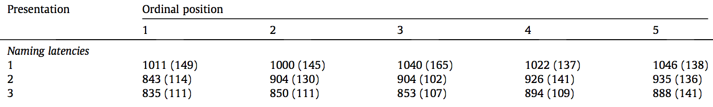

#### Article ID: IBRbN
#### Pilot: Kyle MacDonald
#### Co-pilot: Tom Hardwicke  
#### Start date: 4/21/17
#### End date: 4/24/17  

-------

#### Methods summary: 

On each trial, adult participants saw pictures of concrete objects (e.g., a soccer ball) on a computer screen and were asked to produce the verbal label for that object as quickly as possible. The target words were generated from a set of 16 themes (e.g., soccer) and the key predictor variable was the *ordinal position* of the target word within its thematic context -- that is, how many words from that theme had the participant already named in the experiment. The dependent variables were participants' reaction times (RTs) and error rates, and the prediction was that words with higher ordinal positions would have slower RTs because of the "cumulative" interference from the previously named words within that theme.

------

#### Target outcomes: 

For this article you should focus on the findings reported for Experiment 1 in section 2.2. Results and discussion. Specifically, you should attempt to reproduce all descriptive and inferential analyses reported in the text below and associated tables/figures:

> Reaction times (RTs) for correct responses for each ordinal position of an item within the presented theme, collapsed across the three presentations, are presented in Fig. 1 (see also Table 1). A repeated measures analysis of variance (ANOVA) with the factors ordinal position (5) and presentation (3) with participants (F1) and themes (F2) as random variables (cf. Belke and Stielow, 2013 and Howard et al., 2006) revealed a main effects of presentation (F1(2, 46) = 54, p < .001, View the MathML source = .70; F2(2, 30) = 130.6, p < .001, View the MathML source = .89) and ordinal position (F1(4, 92) = 11.1, p < .001, View the MathML source = .33; F2(4, 60) = 7.0, p < .001, View the MathML source = .32). There was no interaction between presentation and ordinal position, Fs < 1.7. For the ordinal position effect, there was a significant linear trend, F1(1, 23) = 36.6, p < .001, View the MathML source = .62; F2(1, 15) = 19.1, p < .001, View the MathML source = .56, indicating that RTs increased linearly with each ordinal position.

> An ANOVA of mean error rates revealed a main effect of presentation (F1 (2, 46) = 26, p < .001, View the MathML source = .53; F2(1, 30) = 30.2, p < .001, View the MathML source = .66) that reflects a decrease in errors between the first and later presentations (cf. Table 1). No other effects were found, Fs < 0.8.

Here's the relevant table and figure from the paper:  




------

```{r global_options, include=FALSE}
knitr::opts_chunk$set(echo=TRUE, warning=FALSE, message=FALSE)
```

## Step 1: Load packages

```{r}
library(tidyverse) # for data munging
library(knitr) # for kable table formating
library(haven) # import and export 'SPSS', 'Stata' and 'SAS' Files
library(readxl) # import excel files
library(CODreports) # custom report functions
library(magrittr) # for compound pipes
library(stringr) # for working with strings
```

## Step 2: Load data

Read the first sheet of excel workbook to get Experiment 1 data.

```{r}
d <- read_excel(path = "data/data.xlsx", sheet = 1)
```

Check the structure of the data.

```{r}
glimpse(d)
```

Data are already in long format and look relatively tidy. 

Check if we have 24 participants.

```{r}
n_expected <- 24

test_n <- d %>% 
  select(`Participant(F1)`) %>% 
  unique() %>% 
  nrow() == n_expected
```

The output of the test is: `r test_n`, so we have the correct number of participants.

Check if we have 5 ordinal positions:

```{r}
pos_expected <- 5

test_ord <- d %>% 
  select(OrdPosition) %>% 
  unique() %>% 
  nrow() == pos_expected
```

The output of the test is: `r test_ord`, so there are a different number of ordinal positions in the data file (reported = 5, obtained = 6).

Check if we have 3 presentations:

```{r}
presents_expected <- 3

test_present <- d %>% select(Presentation) %>% 
  unique() %>% 
  nrow() == presents_expected
```

The output of the test is: `r test_present`, so we have the correct number of presentation orders.

## Step 3: Tidy data

Create binary (T/F) accuracy variable by recoding the `ErrorCode` var (175 = correct; I'm not sure what 176 or 177 mean).

```{r}
correct_code <- 175

d %<>% mutate(correct = ifelse(`ErrorCode (175=correct)` == correct_code, 
                               TRUE, 
                               FALSE))
```

## Step 4: Run analysis

### Pre-processing

No pre-processing steps reported in the paper.

### Descriptive statistics

Try to reproduce the values in Table 1. From the table caption, 

> Mean naming latencies in milliseconds, mean error rates in percent and the corresponding standard deviations of means for each ordinal position and presentation.

INSUFFICIENT INFORMATION ERROR (data aggregation steps)

Rose and Rahman do not report whether they averaged for participants prior to getting condition averages, so I wasn't exactly sure how to do the aggregation to reproduce their table.

```{r}
# average rt each participant and condition
ss_rt <- d %>% 
  filter(correct == T) %>% # just keep correct RTs
  group_by(`Participant(F1)`, OrdPosition, Presentation) %>% 
  summarise(ss_rt = mean(RT)) 
  
# for each condition
ms_rt <- ss_rt %>% 
  group_by(OrdPosition, Presentation) %>% 
  summarise(m = mean(ss_rt),
            stdev = sd(ss_rt)) %>% 
  mutate(measure = "rt") %>% 
  mutate_if(is.numeric, round, digits = 0)

ms_rt %>% kable()
```

INSUFFICIENT INFORMATION ERROR (handling filler trials)

Many of the obtained RT values are off by 1-2 msecs. But, when I aggregated I get a sixth ordinal position. After looking at the data file, I realized that this is caused by including the filler trials. But, the paper doesn't specify how we should handle these trials.

Get the marginal means and standard deviations for RT for Ordinal Positions collapsing across Presentations.

```{r}
ms_ord_pos <- ss_rt %>% 
  group_by(OrdPosition) %>% 
  summarise(m = mean(ss_rt),
            stdev = sd(ss_rt)) %>% 
  mutate(measure = "rt") %>% 
  mutate_if(is.numeric, round, digits = 0)

ms_ord_pos %>% kable()
```

Get the marginal means and standard deviations for RT for Presentations collapsing across Ordinal Position.

```{r}
ms_pres <- ss_rt %>% 
  group_by(Presentation) %>% 
  summarise(m = mean(ss_rt),
            stdev = sd(ss_rt)) %>% 
  mutate(measure = "rt") %>% 
  mutate_if(is.numeric, round, digits = 0)

ms_pres %>% kable()
```

Do the same aggregation for accuracy scores (reported in %). Note that we multiply by 100 to convert proportion to percentage and then subtract from 100 to convert to mean error rate.

```{r}
# average rt each participant and condition
ss_acc <- d %>% 
  group_by(`Participant(F1)`, OrdPosition, Presentation) %>% 
  summarise(ss_acc = mean(correct)) 
  
# average for each condition '
ms_acc <- ss_acc %>% 
  group_by(OrdPosition, Presentation) %>% 
  summarise(m = 100 - (mean(ss_acc) * 100),
            stdev = (sd(ss_acc) * 100)) %>% 
  mutate(measure = "accuracy") %>% 
  mutate_if(is.numeric, round, digits = 1) 

ms_acc %>% kable()
```

Get marginal means for Ordinal Position collapsing across presentations.

```{r}
ms_acc_ord_pos <- ss_acc %>% 
  group_by(OrdPosition) %>% 
  summarise(m = 100 - (mean(ss_acc) * 100),
            stdev = (sd(ss_acc) * 100)) %>% 
  mutate(measure = "accuracy") %>% 
  mutate_if(is.numeric, round, digits = 1) 

ms_acc_ord_pos %>% kable()
```

Get marginal means for Presentations collapsing Ordinal Position.

```{r}
ms_acc_presentation <- ss_acc %>% 
  group_by(Presentation) %>% 
  summarise(m = 100 - (mean(ss_acc) * 100),
            stdev = (sd(ss_acc) * 100)) %>% 
  mutate(measure = "accuracy") %>% 
  mutate_if(is.numeric, round, digits = 1) 

ms_acc_presentation %>% kable()
```

### Inferential statistics

**RT:** Try to reproduce the RT ANOVA model. From the paper,

> A repeated measures analysis of variance (ANOVA) with the factors ordinal position (5) and presentation (3) with participants (F1) and themes (F2) as random variables (cf. Belke and Stielow, 2013 and Howard et al., 2006) revealed a main effects of presentation (F1(2, 46) = 54, p < .001, View the MathML  = .70; F2(2, 30) = 130.6, p < .001, View the MathML source = .89) and ordinal position (F1(4, 92) = 11.1, p < .001, View the MathML source = .33; F2(4, 60) = 7.0, p < .001, View the MathML source = .32).

Note that "View the MathML source" = $\eta_p^2$

```{r}
d.rt.model <- d %>% filter(correct == TRUE) %>% # only include correct RTs model
  mutate(`Theme(F2)` = ifelse(str_detect(`Theme(F2)`, "Filler"), 
                              "Filler",`Theme(F2)`)) %>% 
  select(`Participant(F1)`, `Theme(F2)`, Presentation, OrdPosition, RT) %>% 
  mutate_at(vars(1:4), funs(as.factor))
```

Fit the RT model.

```{r}
m1.rt <- aov(RT ~ OrdPosition * Presentation + 
               Error(`Participant(F1)` / `Theme(F2)`), 
          data = d.rt.model)

summary(m1.rt)
```

**Linear trend:** Try to reproduce the linear trend model. From the paper, 

> For the ordinal position effect, there was a significant linear trend, F1(1, 23) = 36.6, p < .001, View the MathML source = .62; F2(1, 15) = 19.1, p < .001, View the MathML source = .56, indicating that RTs increased linearly with each ordinal position.

INSUFFICIENT INFORMATION ERROR (fitting a second model to RT data)

It is not clear to me whether they are fitting a second model to the RT data, and if they are the model is not clearly specified. 

```{r}

```

INSUFFICIENT INFORMATION ERROR (specification of random effects)

Building the RT model from the information given in the text was difficult. Specifically, I wasn't sure exactly how the random effects were specified and how many levels of the `Theme` variable should go into the model. When I first ran the model, there were 24 levels, but I looked back in the material section which said there were only 16. So do we collapse across the 6 different "filler" themes? Do we include the filler themes at all? It also isn't clear whether they are modeling the data at the trial level or if they are aggregating to the participant-level prior to the modeling step.

Finally, when I was digging into the issue about including fillers in the ANOVA, I realized that the authors don't report whether these trials were included in the descriptive analyses of mean RT and Error rates. Together, I think the lack of information about how to specify the model and which data are going into the model crosses the threshold of an information error. So I went back and flagged this in the descriptive statistics section above.

**Accuracy:** Try to reproduce the ANOVA model on mean error rates. From the paper, 

> An ANOVA of mean error rates revealed a main effect of presen- tation (F1 (2, 46) = 26, p < .001, g2p = .53; F2(1, 30) = 30.2, p < .001, g2p = .66) that reflects a decrease in errors between the first and
later presentations (cf. Table 1). No other effects were found, Fs < 0.8.

First, prep the data for the model by converting predictor variables to factors and aggregating to get mean error rates.

```{r, eval = F}
d.acc.model <- d %>% 
  mutate(`Theme(F2)` = ifelse(str_detect(`Theme(F2)`, "Filler"), 
                              "Filler",`Theme(F2)`)) %>% 
  select(`Participant(F1)`, `Theme(F2)`, Presentation, OrdPosition, correct) %>% 
  mutate_at(vars(1:4), funs(as.factor))
```

Fit the accuracy model:

```{r, eval = F}
m1.acc <- aov(correct ~ OrdPosition * Presentation + 
               Error(`Participant(F1)` / `Theme(F2)`), 
          data = d.acc.model)

summary(m1.acc)
```

INSUFFICIENT INFORMATION ERROR (data aggregation steps)

Again, I'm not sure what numbers actually go into the ANOVA since the aggregation process is not clear (to me at least) from the text. And there must have been some aggregation because they use a linear model on binary accuracy data. 

## Step 5: Conclusion

```{r}
codReport(Report_Type = 'pilot',
          Article_ID = 'IBRbN', 
          Insufficient_Information_Errors = 4,
          Decision_Errors = 0, 
          Major_Numerical_Errors = 0, 
          Minor_Numerical_Errors = 0)
```

Overall, I thought the authors facilitated reproducibility by providing a tidy data file. However, the results section did not clearly describe several important steps in the analysis that made it impossible for me to know if I was reproducing their analysis. Specifically, they do not report how the data were aggregated prior to modeling with their ANOVAs; they do not provide information about how they tested for the presence of a linear trend in the RT ANOVA; they do not provide enough information about how to specify the random effects in their models; and they do not report whether filler trials were included in the analyses. 

Note that since I did not have enough information to do the analysis, I did not compare the reported and obtained numerical values. So a score a 0 in the `codReport` function is really more like an "NA" since there could be differences once we run the correct analyses.

```{r session_info, include=TRUE, echo=TRUE, results='markup'}
devtools::session_info()
```
